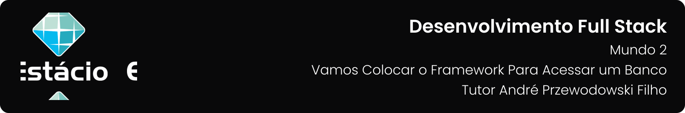

---

[Projeto](#-projeto) • [Como baixar e executar](#-como-baixar-e-executar) • [Procedimentos](#-procedimentos) • [Tecnologias utilizadas](#-tecnologias-utilizadas) • [Autor](#-autor) • [Licença](#-licença)

---

## 📋 Projeto

Missão Prática com o objetivo de implementar servidor baseado em Express e Mongoose, acessando o banco de dados MongoDB, e front-ends baseados em React, Next.js e Angular apresentada no  **`Nível 5: Vamos colocar o framework para acessar um banco`** do  **`Mundo 2`** do curso de  **`Desenvolvimento Full Stack`** da **`Estácio`**, do semestre de  **`2023.2`**, sob a tutoria de André Przewodowski Filho.

Projeto elaborado de acordo com as diretrizes especificadas para a Missão Prática, que podem ser conferidas [**`clicando aqui`**](https://sway.office.com/s/W3QP981juMlvGPIv/embed).

## 📥 Como baixar e executar

Para baixar os arquivos deste repositório, você deve ter o [GitHub](https://github.com/) instalado em seu dispositivo.

Após instalado, você deverá acessar a guia `Arquivo` → `Clonar repositório` → `URL` e incluir o caminho `guedesert/vamos-colocar-o-framework-para-acessar-um-banco`.

Além disso, é interessante que você tenha um bom editor para trabalhar com os códigos, dos quais eu recomendo o uso do, [Visual Studio Code](https://code.visualstudio.com/).

## 🔗 Procedimentos

Durante o projeto foram desenvolvidos 03 procedimentos descritos abaixo:

<table>
  <tr>
    <th>Procedimento</th>
    <th>Descrição</th>
  </tr>
  <tr>
    <td>Criando o Servidor com Express e Mongoose</td>
    <td>
      <ul>
        <li>Configure um servidor Node.js com Express e Mongoose.</li>
        <li>Crie um banco de dados MongoDB chamado "livraria" com a coleção "livros".</li>
        <li>Implemente rotas e funções para gerenciar livros (obter, incluir, excluir).</li>
        <li>Configure o servidor Express na porta 3030 e gerencie o CORS.</li>
      </ul>
    </td>
  </tr>
  <tr>
    <td>Alteração dos Projetos Clientes</td>
    <td>
      <ul>
        <li>Copie os projetos "livros-react," "livros-next," e "livros-angular" para um diretório "clientes".</li>
        <li>Faça ajustes nos projetos para se comunicarem com o servidor Express.</li>
      </ul>
    </td>
  </tr>
</table>

## 🛠 Tecnologias utilizadas

Para a construção e execução do projeto foram utilizadas as seguintes tecnologias:

         

## 👥 Autor

| Aluno                                                  | Matrícula    | E-mail                                      |
| ------------------------------------------------------ | ------------ | ------------------------------------------- |
| [Emanuel Roseira Guedes](https://github.com/guedesert) | 202212181407 | [📧](mailto:202212181407@alunos.estacio.br) |

## 📃 Licença

Este repositório está licensiado sob a [Licença MIT](./LICENSE).

